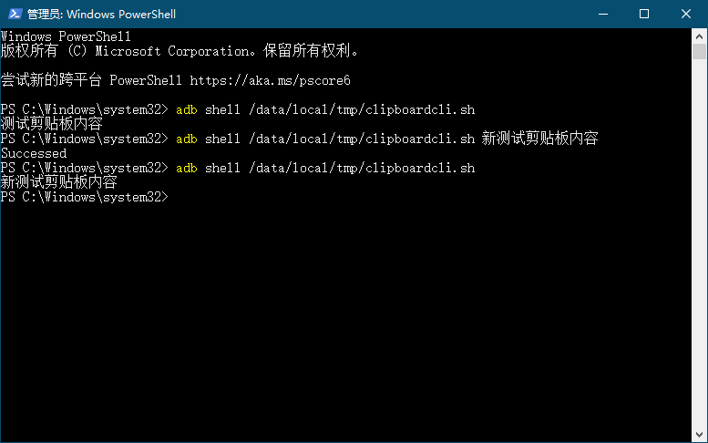

# clipboardcli
命令行剪贴板管理工具  
## 简介
通过shell权限使用app_process启动一个特殊的APP，可以获取手机的剪贴板或设置手机剪贴板。支持Android10。  

## 使用方法
adb push clipboardcli-x.x.x-release.apk /data/local/tmp/clipboardcli.apk  
adb push clipboardcli.sh /data/local/tmp/clipboardcli.sh  
adb shell chmod +x /data/local/tmp/clipboardcli.sh  
## 获取剪贴板
adb shell /data/local/tmp/clipboardcli.sh
## 设置剪贴板
adb shell /data/local/tmp/clipboardcli.sh <需要设置的剪贴板内容>
## 高级应用
1、手机运行atx-agent代理程序，通过curl和atx-agent通信，让atx-agent代为执行clipboardcli，则其它程序可以间接获取或设置手机剪贴板。  
2、在电脑上自定义powershell函数，一个命令即可是手机和电脑剪贴板同步。  
## 感谢
感谢项目，给我灵感。Scrcpy是一个低延迟高效率的Android投屏软件，非常棒的一个项目。
